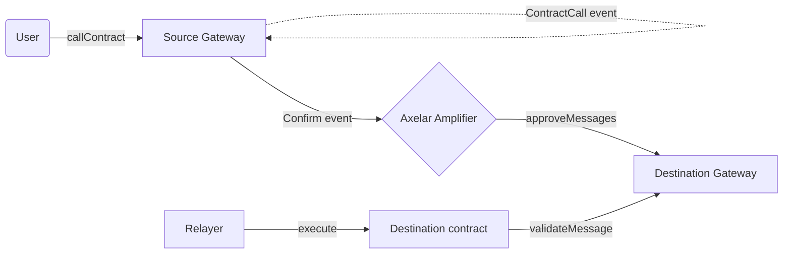
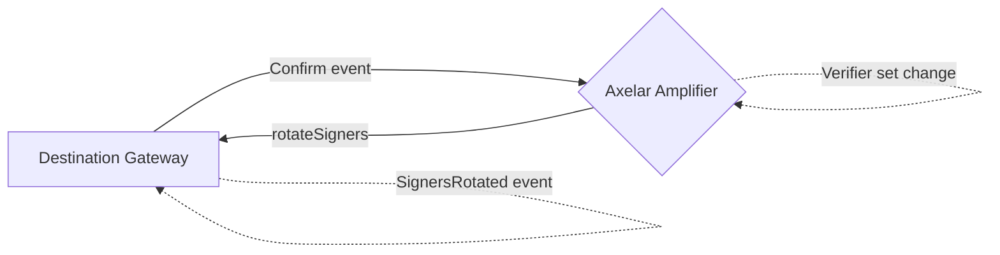

# Axelar Amplifier Gateway Integration

Axelar Amplifier Gateway is a smart contract that lives on the external chain that is connecting to the Axelar Network. It faciliates sending and receiving of cross-chain messages to other chains via the Axelar Network. `AxelarAmplifierGateway` is the EVM reference implementation of the external gateway.

The following sections walk through the integration requirements when implementing the external gateway contract for a given chain. Other implementation details can vary, and we recommend to use the idiomatic design pattern specific to that chain where possible.

## Entrypoints

The following are the main entrypoints for the gateway contract.

```solidity
// Initiate a cross-chain contract call
function callContract(string calldata destinationChain, string calldata contractAddress, bytes calldata payload) external;

// Record approvals for a set of messages, signed off by Axelar verifiers
function approveMessages(Message[] calldata messages, Proof calldata proof) external;

// Validate a message approval, and mark it as used
function validateMessage(string calldata messageId, string calldata sourceChain, string calldata sourceAddress, bytes32 payloadHash) external returns (bool);

// Rotate to a new set of Axelar verifiers, signed off by the current Axelar verifiers
function rotateSigners(WeightedSigners memory newSigners, Proof calldata proof) external;

// Legacy method only needed on EVM chains for backwards compatibility.
// Validate a message approval via the commandId, and mark it as used
function validateContractCall(bytes32 commandId, string calldata sourceChain, string calldata sourceAddress, bytes32 payloadHash) external returns (bool);
```

The following entrypoint is needed for the Axelar Executable interface that application contracts are expected to implement.

```solidity
function execute(
    string calldata messageId,
    string calldata sourceChain,
    string calldata sourceAddress,
    bytes calldata payload
) external;

// Legacy version for EVM chains for backwards compatibility
function execute(
    bytes32 commandId,
    string calldata sourceChain,
    string calldata sourceAddress,
    bytes calldata payload
) external;
```

The simplified cross-chain messaging flow looks like the following:



The verifier/signer rotation flow looks like the following:



You can find more details in our [docs](https://docs.axelar.dev/dev/general-message-passing/overview).

## Message type

A message has the following type. The `contractAddress` is the destination address receiving the contract call. It's type can be chosen based on the destination chain's contract address format, or left as string. Only the payload hash is required here.

```solidity
struct Message {
    string messageId;
    string sourceChain;
    string sourceAddress;
    address contractAddress;
    bytes32 payloadHash;
}
```

## Authentication

The gateway contract uses a weighted multisig scheme to approve messages. Each Axelar verifier has a public key (or address) and a weight (stake). An appropriate threshold is configured on Axelar Amplifier. The auth verification functionality can be found in [BaseWeightedMultisig](../governance/BaseWeightedMultisig.sol). A weighted signer set has the following type:

```solidity
struct WeightedSigner {
    address signer;
    uint128 weight;
}

struct WeightedSigners {
    WeightedSigner[] signers;
    uint128 threshold;
    bytes32 nonce;
}
```

A `nonce` is assigned by Amplifier to distinguish between repeated signer sets (as it's possible to rotate to the same set of signers in the future). The hash of `WeightedSigners` is used to prevent replay of the rotation.

The Axelar verifiers construct a proof (signatures) over the following message hash. The proof type is:

```solidity
struct Proof {
    WeightedSigners signers;
    bytes[] signatures;
}
```

The data hash is calculated depending on the command type.

```solidity
enum CommandType {
    ApproveMessages,
    RotateSigners
}

// For approveMessages. `messages` has type `Message[]`
bytes32 dataHash = keccak256(abi.encode(CommandType.ApproveMessages, messages));

// For rotateSigners. `newSigners` has type `WeightedSigners`
bytes32 dataHash = keccak256(abi.encode(CommandType.RotateSigners, newSigners));
```

The message hash to be signed is then:

```solidity
bytes32 messageHash = keccak256(abi.encodePacked('\x19Ethereum Signed Message:\n96', domainSeparator, signersHash, dataHash));
```

- `domainSeparator` is an opaque value created by Amplifier to distinguish distinct chains, that the external gateway should be initialized with.
- `signersHash` is equal to `keccak256(abi.encode(signers))`, to commit to the signer set being used to sign the message.
- `dataHash` is calculated as per above

The encoding format can be customized for non-EVM chains, but it should consist of the above 3 values. EVM authentication uses this [format](https://ethereum.org/en/developers/docs/apis/json-rpc/#eth_sign) to sign arbitrary messages to distinguish them from EVM transactions. If using a custom encoding, the [multisig-prover](https://github.com/axelarnetwork/axelar-amplifier) contract on Axelar Amplifier needs to be extended to support this encoding format.

The EVM gateway uses recoverable SECP256k1 ECDSA signatures. Amplifier also supports `ed25519` signatures that other gateway implementations can use if preferred.

## Replay Prevention

Axelar Amplifier protocol allows re-sigining/re-routing of any message, i.e the same message can be signed off in a new batch of messages by a set of Axelar verifiers in the future. It's upto the external gateway to prevent re-approval of the same message. Furthermore, a message that is validated/executed on the destination contract shouldn't be allowed to be re-approved as well.

Amplifier guarantees that the combination of source chain and message id will always be unique and fixed for a unique message. Hence, a deterministic command id can be derived based on the source chain and message id, and mark as executed to prevent replay.

The EVM gateway derives the command id as follows. External gateways for other chains can choose to use their own encoding scheme if preferred, as long as it's deterministic and includes the same values as below.

```solidity
// sourceChain is guaranteed to not contain `_` character
// abi.encodePacked just concatenates the strings as bytes
bytes32 commandId = keccak256(abi.encodePacked(sourceChain, '_', messageId));
```

Each message approval has one of the following 3 states, that it stores under the `commandId`:

1. `MESSAGE_NONEXISTENT` equal to `0` if the message has never been approved.
2. `MESSAGE_APPROVED` equal to the `Message` hash if the message is approved. This ensures that metadata such as `sourceAddress`, `destinationAddress`, `payloadHash` is valid in addition to `sourceChain` and `messageId`.
3. `MESSAGE_EXECUTED` equal to `1`, if the approved message has been executed.

The `validateMessage` method checks if the message is in `MESSAGE_APPROVED` status. If yes, it should update the status to `MESSAGE_EXECUTED` to prevent replay. It will return `true`/`false` depending on whether the message was in approved status, to allow `AxelarExecutable.execute` to execute the internal app logic.

Signer rotation has it's own replay prevention as described in an earlier section.

## Events

There are certain events that the gateway contract is required to emit.

A `ContractCall` event needs to be emitted within `callContract`. This event is required by the Axelar verifiers to verify that the message was sent. Furthermore, the relayer for that chain will also monitor this event to trigger confirmation of the message on Axelar Amplifier (via the Amplifier Relayer API in practice that simplifies interacting with the Axelar network). Axelar verifiers run the `ampd` process that will check if this event was present in the provided tx. `ampd` needs to be extended to support event verification for a specific chain, see example [here](https://github.com/axelarnetwork/axelar-amplifier/tree/7e65688e7304a44436627fc3193483d24a10a14d/ampd/src/sui).

```solidity
event ContractCall(
    address indexed sender,
    string destinationChain,
    string destinationContractAddress,
    bytes32 indexed payloadHash,
    bytes payload
);
```

A `ContractCallApproved` event needs to be emitted for each message approval within `approveMessages`. The relayer for the destination chain listens for this event to execute the cross-chain contract call on the destination contract address (by calling `AxelarExecutable.execute`).

Note: Gateway contracts for non-EVM chains can omit exposing the `commandId` in the events, and use `sourcChain` with `messageId` combination for tracking the message. `commandId` is used for EVM gateway for backwards compatibility for applications, and requires the EVM relayer to maintain a `commandId` <-> `messageId` mapping.

```solidity
event ContractCallApproved(
    bytes32 indexed commandId,
    string messageId,
    string sourceChain,
    string sourceAddress,
    address indexed contractAddress,
    bytes32 indexed payloadHash
);
```

A `ContractCallExecuted` event needs to be emitted when `validateMessage` is called. The relayer for the destination chain listens for this event to mark the message as executed (by calling the Amplifier Relayer API). This is required for processing any excess gas refunds for the cross-chain message, indexing, debugging purposes.

```solidity
event ContractCallExecuted(bytes32 indexed commandId);
```

A `SignersRotated` event needs to be emitted when `rotateSigners` is called. This event is required by Axelar verifiers to confirm the signer/verifier rotation was executed, so that Amplifier can switch to signing with the new verifier set. The relayer for the destination chain also listens for this event to initiate the confirmation of the verifier rotation on Amplifier.

```solidity
event SignersRotated(uint256 indexed epoch, bytes32 indexed signersHash, bytes signers);
```

## Upgradability

The gateway contract is designed to be upgradable. The owner can upgrade the contract to a new version by calling the `upgrade` function. The new contract address is passed as an argument to the function. The new contract must be compatible with the existing storage layout. The gateway owner is expected to be the [governance contract](../governance/InterchainGovernance.sol) that can trigger upgrades by receiving GMP calls. The implementation of the upgrade method is expected to vary for non-EVM chains.

## Testing

Unit tests for the gateway can be found [here](../../test/gateway/AxelarAmplifierGateway.js) to use as reference for the implementation for another chain. Other than standard testing practices like code coverage, Axelar Amplifier devnet e2e testing framework will support adding connectors for different chains. More details to come.
