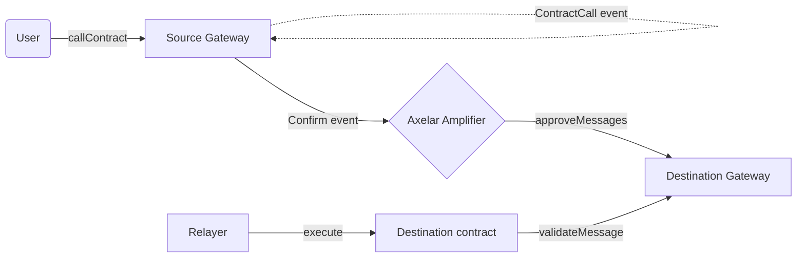
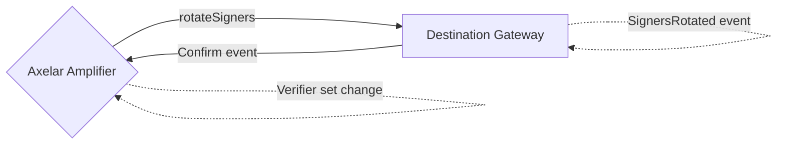

# Axelar Amplifier Gateway Integration

Axelar Amplifier Gateway is a smart contract that lives on the external chain that is connecting to the Axelar Network. It facilitates sending and receiving of cross-chain messages to other chains via the Axelar Network. `AxelarAmplifierGateway` is the EVM [reference implementation](./AxelarAmplifierGateway.sol) of the external gateway.

The following sections walk through the integration requirements when implementing the external gateway contract for a given chain. Other implementation details can vary, and we recommend to use the idiomatic design pattern specific to that chain where possible.

We also recommend that integrators create an `INTEGRATION.md` for their implementation of this reference, detailing the specifics of the implementation, including any deviations from the reference.

## Interface

The following is the main interface exposed by the Axelar gateway contract.

```solidity
// Initiate a cross-chain contract call
function callContract(string calldata destinationChain, string calldata contractAddress, bytes calldata payload) external;

// Record approvals for a set of messages, signed off by Axelar verifiers
function approveMessages(Message[] calldata messages, Proof calldata proof) external;

// Validate a message approval, and mark it as used
function validateMessage(string calldata sourceChain, string calldata messageId, string calldata sourceAddress, bytes32 payloadHash) external returns (bool);

// Query if a message is approved
function isMessageApproved(string calldata sourceChain, string calldata messageId, string calldata sourceAddress, address contractAddress, bytes32 payloadHash) external view returns (bool);

// Query if a message has been executed
function isMessageExecuted(string calldata sourceChain, string calldata messageId) external view returns (bool);

// Rotate to a new set of Axelar verifiers, signed off by the current Axelar verifiers
function rotateSigners(WeightedSigners memory newSigners, Proof calldata proof) external;
```

The EVM Amplifier gateway also supports legacy methods for compatibility with the existing EVM `AxelarExecutable` contract. These aren't needed for gateway implementations for non-EVM chains.

```solidity
// Legacy method only needed on EVM chains for backwards compatibility.
// Validate a message approval via the commandId, and mark it as used
function validateContractCall(bytes32 commandId, string calldata sourceChain, string calldata sourceAddress, bytes32 payloadHash) external returns (bool);
```

The following entrypoint is needed for the `AxelarExecutable` interface that application contracts are expected to implement.

```solidity
function execute(
    string calldata sourceChain,
    string calldata messageId,
    string calldata sourceAddress,
    bytes calldata payload
) external;

// Legacy version for EVM chains for backwards compatibility
function execute(
    bytes32 commandId,
    string calldata sourceChain,
    string calldata sourceAddress,
    bytes calldata payload
) external;
```

The simplified cross-chain messaging flow looks like the following:



The verifier/signer rotation flow looks like the following:



You can find more details in our [docs](https://docs.axelar.dev/dev/general-message-passing/overview).

## Code Style

The EVM Amplifier gateway contract inherits both the base gateway logic, and the auth logic into a single contract. This is done to simplify the deployment and upgrade process for the gateway. The gateway contract is well within the bytecode size limit of EVM. However, this pattern may not be suitable for non-EVM chains. In those scenarios, it might be helpful to split the auth logic into a separate contract, that is owned by the gateway contract. Only the gateway should be allowed to call signer rotation on it. Furthermore, the auth contract should allow initializing a list of signer sets on deployments. This will be needed on upgrades, where a new auth contract deployment needs to be set up with the full list of recent signers.

## Message type

A message has the following type. The `contractAddress` is the destination address receiving the contract call. It's type can be chosen based on the destination chain's contract address format, or left as string. Only the payload hash is required here.

```solidity
struct Message {
    string sourceChain;
    string messageId;
    string sourceAddress;
    address contractAddress;
    bytes32 payloadHash;
}
```

## Authentication

The gateway contract uses a weighted multisig scheme to approve messages. Each Axelar verifier has a public key (or address) and a weight (stake). An appropriate threshold is configured on Axelar Amplifier. The auth verification functionality can be found in [BaseWeightedMultisig](../governance/BaseWeightedMultisig.sol). A weighted signer set has the following type:

```solidity
struct WeightedSigner {
    address signer;
    uint128 weight;
}

struct WeightedSigners {
    WeightedSigner[] signers;
    uint128 threshold;
    bytes32 nonce;
}
```

- For EVM, the signer is represented by the EVM `address` type since recoverable SECP256k1 ECDSA signatures are used. Amplifier also supports `ed25519` signatures that other gateway implementations can use if preferred. The signer could be represented by a public key as well.
- Amplifier uses `u128` for the weights of each signer. At launch, every signer will have of weight of `1` but this is expected to change to stake based in the future.
- A unique `nonce` is assigned by Amplifier to each signer set to distinguish between repeated signers (as it's possible to rotate to the same set of signers in the future). The hash of `WeightedSigners` is used to prevent replay of the rotation.

The Axelar verifiers construct a proof (signatures) over the following message hash. The proof type is:

```solidity
struct Proof {
    WeightedSigners signers;
    bytes[] signatures;
}
```

The data hash is calculated depending on the command type.

```solidity
enum CommandType {
    ApproveMessages,
    RotateSigners
}

// For approveMessages. `messages` has type `Message[]`
bytes32 dataHash = keccak256(abi.encode(CommandType.ApproveMessages, messages));

// For rotateSigners. `newSigners` has type `WeightedSigners`
bytes32 dataHash = keccak256(abi.encode(CommandType.RotateSigners, newSigners));
```

The message hash to be signed is then:

```solidity
bytes32 messageHash = keccak256(bytes.concat('\x19Ethereum Signed Message:\n96', domainSeparator, signersHash, dataHash));
```

- `domainSeparator` is an opaque value created by Amplifier to distinguish distinct chains, that the external gateway should be initialized with.
- `signersHash` is equal to `keccak256(abi.encode(signers))`, to commit to the signer set being used to sign the message.
- `dataHash` is calculated as per above

The encoding format can be customized for non-EVM chains, but it should consist of the above 3 values. EVM authentication uses this [format](https://ethereum.org/en/developers/docs/apis/json-rpc/#eth_sign) to sign arbitrary messages to distinguish them from EVM transactions. If using a custom encoding, the [multisig-prover](https://github.com/axelarnetwork/axelar-amplifier) contract on Axelar Amplifier needs to be extended to support this encoding format. Similar to the EVM encoding, consider adding an appropriate prefix to the message hash to distinguish it from the chain specific transaction format (if there's a spec for signing custom messages for that chain, that should be used ideally, and should be supported by the chain's client SDK to do it within scripts).

## Replay Prevention

Axelar Amplifier protocol allows re-sigining/re-routing of any message, i.e the same message can be signed off in a new batch of messages by a set of Axelar verifiers in the future. It's upto the external gateway to prevent re-approval of the same message. Furthermore, a message that is validated/executed on the destination contract shouldn't be allowed to be re-approved as well.

Amplifier guarantees that the combination of source chain and message id will always be unique and fixed for a unique message. Hence, a deterministic command id can be derived based on the source chain and message id, and mark as executed to prevent replay.

The EVM gateway derives the command id as follows. External gateways for other chains can choose to use their own encoding scheme if preferred, as long as it's deterministic and includes the same values as below.

```solidity
// sourceChain is guaranteed to not contain `_` character
bytes32 commandId = keccak256(bytes(string.concat(sourceChain, '_', messageId)));
```

Each message approval has one of the following 3 states, that it stores under the `commandId`:

1. `MESSAGE_NONEXISTENT` equal to `0` if the message has never been approved.
2. `MESSAGE_APPROVED` equal to the `Message` hash if the message is approved. This ensures that metadata such as `sourceAddress`, `destinationAddress`, `payloadHash` is valid in addition to `sourceChain` and `messageId`.
3. `MESSAGE_EXECUTED` equal to `1`, if the approved message has been executed.

The `validateMessage` method checks if the message is in `MESSAGE_APPROVED` status. If yes, it should update the status to `MESSAGE_EXECUTED` to prevent replay. It will return `true`/`false` depending on whether the message was in approved status, to allow `AxelarExecutable.execute` to execute the internal app logic.

Signer rotation has it's own replay prevention as described in an earlier section.

## Events

There are certain events that the gateway contract is required to emit.

A `ContractCall` event must be emitted within `callContract`. This event specifies the actual message being sent and is required by the Axelar verifiers to verify that the message was sent. Furthermore, the relayer for that chain will also monitor this event to trigger confirmation of the message on Axelar Amplifier (via the Amplifier Relayer API in practice that simplifies interacting with the Axelar network). Axelar verifiers run the `ampd` process that will check if this event was present in the provided tx. `ampd` needs to be extended to support event verification for a specific chain, see example [here](https://github.com/axelarnetwork/axelar-amplifier/tree/81b60615c1a76ffbd6da600e6e698d1dd9504ef1/ampd/src/sui).

```solidity
event ContractCall(
    address indexed sender,
    string destinationChain,
    string destinationContractAddress,
    bytes32 indexed payloadHash,
    bytes payload
);
```

A `MessageApproved` event needs to be emitted for each message approval within `approveMessages`. The relayer for the destination chain listens for this event to execute the cross-chain contract call on the destination contract address (by calling `AxelarExecutable.execute`). The relayer should use the combination of `sourceChain` with `messageId` for querying the message approval from Amplifier. The payload can be fetched via the Amplifier Relayer API (keyed by the payload hash). `commandId` (derived from `sourceChain` and `messageId`) is also included in the event for easier indexing (some chains like EVM chains allow efficient retrieval of events by indexed fields/topics).

```solidity
event MessageApproved(
    bytes32 indexed commandId,
    string sourceChain,
    string messageId,
    string sourceAddress,
    address indexed contractAddress,
    bytes32 indexed payloadHash
);
```

A `MessageExecuted` event needs to be emitted when `validateMessage` is called. The relayer for the destination chain listens for this event to mark the message as executed (by calling the Amplifier Relayer API). This is required for processing any excess gas refunds for the cross-chain message on the source chain, indexing, and debugging purposes. Similar to above, `commandId` is also included. The event for the EVM gateway only emits `commandId` due to backwards compatibility with `validateContractCall` (since it doesn't get `messageId` as an argument).

```solidity
event MessageExecuted(bytes32 indexed commandId, string sourceChain, string messageId);
```

A `SignersRotated` event needs to be emitted by the gateway when `rotateSigners` is called. This event is required by Axelar verifiers to confirm the signer/verifier rotation was executed, so that Amplifier can switch to signing with the new verifier set. The relayer for the destination chain also listens for this event to initiate the confirmation of the verifier rotation on Amplifier. A typed `signers` field can be used for the event if the chain supports it.

```solidity
event SignersRotated(uint256 indexed epoch, bytes32 indexed signersHash, bytes signers);
```

## Upgradability

The gateway contract must be upgradable. A gateway owner should be set which has the permission to upgrade the contract. The gateway owner should be allowed to be either an account, or another contract. Test deployments will set the owner to some wallet, but production deployments can use a multisig account/contract, and eventually a governance contract. For stable production deployments, the ownership is expected to be transferred to the [AxelarServiceGovernance](../governance/AxelarServiceGovernance.sol) contract which can trigger upgrades by receiving cross-chain messages. This contract must be implemented for the integration.

The EVM gateway uses a proxy pattern for upgrades, i.e there's a fixed proxy contract that delegates calls to an implementation contract, while using the proxy contract's storage. The owner can upgrade the contract to a new version by calling the `upgrade` function. The new contract address is passed as an argument to the function. The stored implementation contract address is updated to the new contract address, thus upgrading the logic (see [here](../upgradable/Upgradable.sol)). Due to this pattern, the EVM gateway gets initialized via a `_setup` method in addition to the static values set in the `constructor`. The new contract must be compatible with the existing storage layout.

The upgrade mechanism is expected to vary for non-EVM chains (some chains support contract upgrades natively).

## Signer rotation delay

The auth mechanism of the gateway contract tracks the recent list of signers that were active. This allows a recent signer set to recover the gateway in the event of a compromise of the latest signer set, or a bug in the gateway or Amplifier that allows rotating to a malicious signer set. To prevent the gateway contract from being lost by successive malicious rotations, a minimum delay is enforced between signer rotations (e.g. 1 day). This allows the decentralized governance to step in to react to any issues (for e.g. upgrade the gateway).

Since the governance makes use of Axelar GMP calls as well, a compromised signer set, or exploit could potentially issue a governance proposal as well. Governance also has a timelock by default which makes reacting to issues slow. Hence, a gateway `operator` can be elected by gateway owner/governance that can collaborate with Axelar governance to bypass signer rotation and governance delays in emergencies. The operator can't perform these actions by itself. It still requires that signers have signed off on the action. This mechanism is useful as it's more unlikely that both the Axelar gateway/governance and the operator have been compromised at the same time.

## Limits

Due to the nature of blockchains, several limits are imposed on what users and contracts can do. These limits can differ significantly between different blockchains. The following details some important limits for this integration. We recommend mentioning the specific limits for your implementation in your own `INTEGRATION.md` doc. If the minimum requirements can't be met, potential workarounds or implications of the limitations will need to be discussed further.

1. **Cross-chain Message Size**: The largest message that can be sent to another chain is restricted by the max size of an event allowed in a transaction for the chain. It can also be indirectly restricted by the max transaction size of the chain. We recommend that the chain supports a minimum of `16KB` for the event/transaction size limit, and ideally more than `64KB` to be flexible.
2. **Chain names**: The Amplifier protocol requires that chain names must be ASCII characters of length less than `20`. Lower case must be used except for a few legacy chain connections on mainnet (`Ethereum`, `Avalanche`, `Polygon`, `Fantom`, and `Moonbeam`, found [here](https://github.com/axelarnetwork/axelar-contract-deployments/blob/main/axelar-chains-config/info/mainnet.json#L6)). The reference external gateway does not perform these checks for gas efficiency, and since Amplifier doesn't allow registering invalid chain names, misuse is easily caught during testing due to failure to verify the message.
3. **Signer Set Size**: The weighted multisig auth mechanism has an arbitrary number of signers. In practice, a minimum of `40` signers should be supported to enforce a minimum security standard for all chains, and ideally at least `100` signers should be allowed. The signing threshold is expected to be set to `2/3`, hence verification of a minimum of `27` signatures should be supported, and ideally at least `67`.
4. **Message Approval Batching**: The gateway accepts a batch of message approvals via `approveMessages`. This batch size is configurable and corresponds to the batch of messages that `construct_proof` was called on in Amplifier. The relayer is responsible for choosing this batch size. Increased batching allows amortizing the gas cost of proof validation across many messages (if they're being executed within a similar time window). The max batch size is dictated by the transaction/block gas limit and size. The EVM gateway consumes `~34k` gas for every additional message approval in the batch.
5. **Storage limit**: The gateway contract stores message execution status. The number of messages stored is arbitrary and will grow over time. Messages that have been executed can't be deleted to prevent replay of approvals. Implementations should support a practically unlimited number of messages to be stored (e.g. `2^64`).
6. **Event Retention**: Cross-chain messages and signer rotations are verified by fetching events from the chain's node. We recommend that events be retained for 2 months, and at a minimum for 2 weeks to allow processing of stuck messages or signer rotations. These could be stuck due to being missed by the relayer, or due to insufficient gas paid by the app (but adds the gas later to process it).

The limit recommendations are summarized in the following table. The limits applicable for the EVM gateway on Ethereum (assuming a block gas limit of 30M) are also shown for comparison.

| Limit | Minimum | Recommended | Ethereum Gateway |
|-|-|-|-|
| Cross-chain Message Size | 16 KB | 64 KB | > 1 MB |
| Chain Name Length | < 20 ASCII chars | - | - |
| Signer Set Size | 40 signers | 100 signers | > 200 |
| Signature Verification | 27 signatures | 67 signatures | > 100 (~3k gas per signature) |
| Message Approval Batching | 1 | Configurable | > 500 (~34k gas per message) |
| Storage Limit for Messages | Practically unlimited (2^64) | Practically unlimited (2^64) | Practically unlimited |
| Event Retention | 2 weeks | 2 months | Unlimited (tunable in node config) |

## Testing

Unit tests for the gateway, and auth mechanism can be found [here](../../test/gateway/AxelarAmplifierGateway.js), and [here](../../test/governance/BaseWeightedMultisig.js), respectively, to use as reference for testing the implementation for another chain. In addition to standard testing practices like unit tests, code coverage, Axelar Amplifier devnet e2e testing framework will support adding connectors for different chains. More details to come.

## Deployment

The official `AxelarAmplifierGateway` contract deployment scripts are located in this [repo](https://github.com/axelarnetwork/axelar-contract-deployments/tree/main/evm#evm-deployment-scripts).
